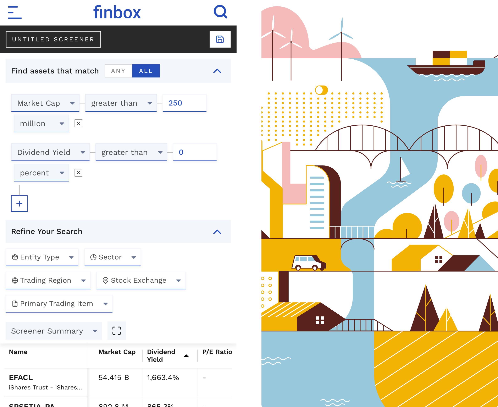
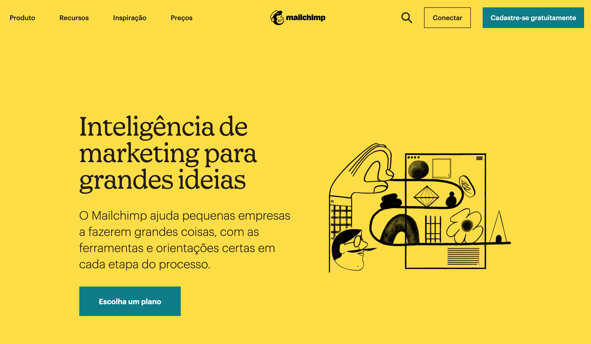

## Design e Desenho
Você não precisa saber desenhar para trabalhar como designer. É uma habilidade que pode te ajudar, mas não é vital.

Finbox e Ilustrações drawkit.io

## Foco
Você não precisa criar a ilustração/foto/vídeo, mas deve saber como/onde utilizá-lo.

Mailchimp