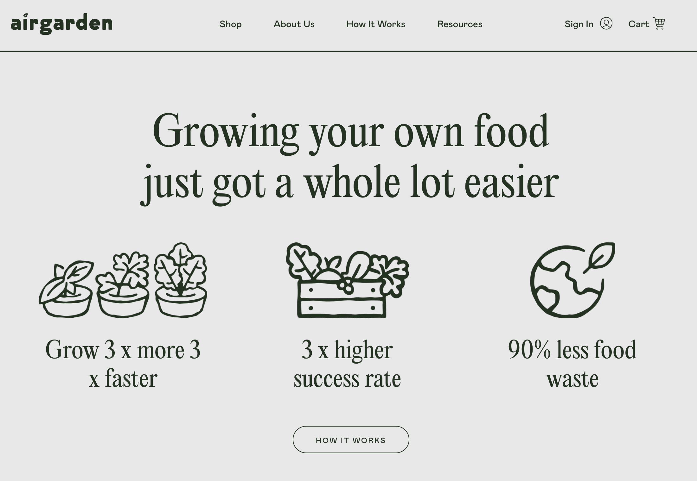
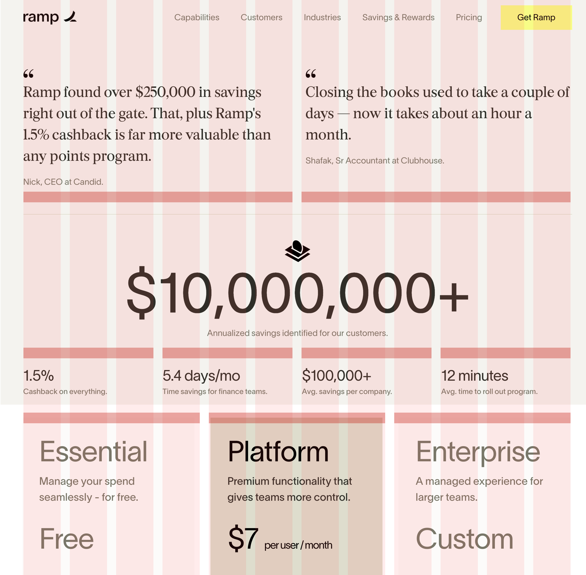

## Espaço
O principal uso do espaço é para definirmos uma relação lógica entre os nossos elementos. Com os espaços podemos:

### Agrupar e separar elementos

### Definir hierarquia

### Organizar informação (Grid)

### Espaço para respirar

## Agrupar e separar
Espaços menores agrupam elementos relacionados. O conceito de espaço maior/menor é relativo aos demais elementos da página.

Espaços maiores separam componentes.

Exemplo:

`https://airgarden.com.au/`

## Definir hierarquia
Com o espaço podemos definir a ordem de importância dos elementos.

Exemplo:

`https://leafshave.com/`

## Grid
O grid é uma malha invisível que serve para posicionarmos os elementos com um alinhamento lógico. Você não precisa ficar restrito ao grid definido, quebras do grid são bem vindas para a criação de contraste.

O grid do site Ramp utiliza uma base de 12 colunas e o conteúdo é organizado dentro das mesmas.

`https://ramp.com/`

## Respirar
Crie espaço entre o conteúdo e a sua borda para permitir que o mesmo respire.

Exemplo:

`https://pleaserepeat.com/`