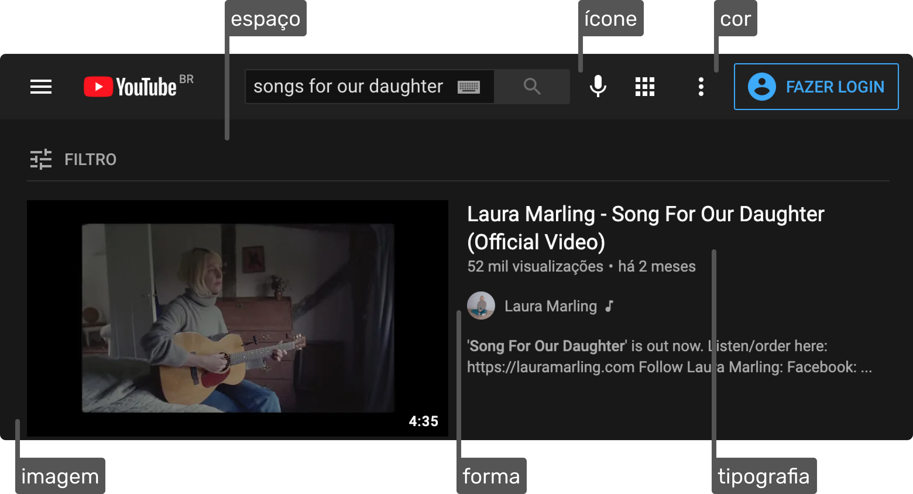

## UI Design

### UI = User Interface = Interface de Usuário
Foco no aprendizado de interfaces digitais.

### Elementos da Interface
Formas, espaço, cores, tipografia, imagens e ícones.

## Interface de Usuário
Interfaces digitais são compostas por textos, textos funcionais, botões, imagens, ícones, vídeos e outros elementos

## Elementos da Interface
As escolhas devem ser consistentes com o projeto. É na consistência que criamos uma unidade, e fazemos com que todos os elementos da interface pareçam pertencer a mesma.

## Importância dos Elementos
A ausência de um elemento apenas, pode arruinar o seu projeto.

Original

Sem Tipografia

Sem Cores

Sem ícones

Sem Imagens

Sem Espaços

## Boa Interface

### Propósito
Existe um motivo claro para a existência do elemento.

### Consistência
Os elementos se comunicam visualmente. Cores em harmonia, espaçamentos equivalentes, ícones de uma mesma família e mais.

### Necessários
A remoção do mesmo tornaria a experiência pior.

## Exemplo de Interface

• Os ícones são consistentes

• O botão mais importante possui o maior contraste

• As informações disponíveis possuem propósito