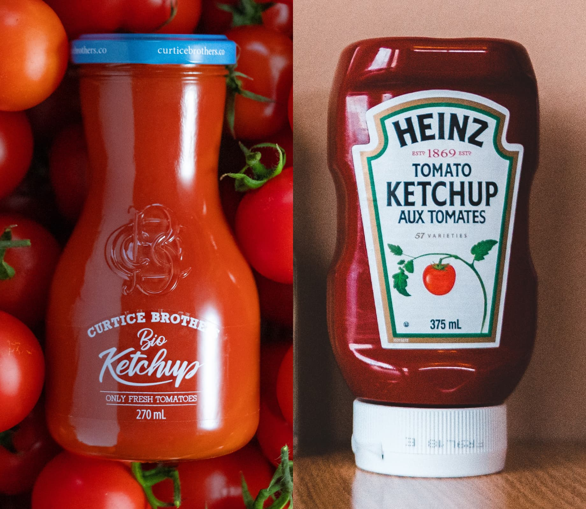
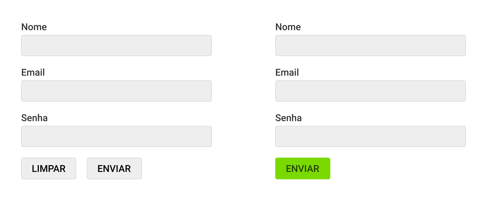

## UX Design

### UX = User Experience = Experiência do Usuário
Design que envolve os usuários impactados pelo projeto.

### Heurísticas e Pesquisa
Boas práticas / entender as necessidades e comportamento.

## UX e UI
Ambos possuem UX e UI, o contexto de uso/usuário define o ideal.

## Usuário
O comportamento do usuário deve guiar as nossas escolhas.

## Heurísticas
Boas práticas definidas através de pesquisas e observações.

### Facilite o escaneamento das informações
Os usuários geralmente escaneiam o conteúdo através de links, títulos e listas.

### Opções visíveis são mais acessadas
Mantenha visível os links para as principais partes do site.

`https://www.nngroup.com/articles/hamburger-menus/`

## Heurísticas Aplicada

 
`https://stripe.com/pt-br-ie`

## Pesquisa
UX Design é 80% pesquisa com os usuários impactados pelo projeto.

### Empatia

Pesquisa com usuários, concorrentes, especialistas e estudos.

### Definir

Definir os problemas que serão o foco do projeto.

### Idealizar

Definir ideias que podem solucionar o problema.

### Prototipar

Materializar soluções a partir das ideias definidas.

### Testar

Testar a solução com o usuário final e identificar melhorias.